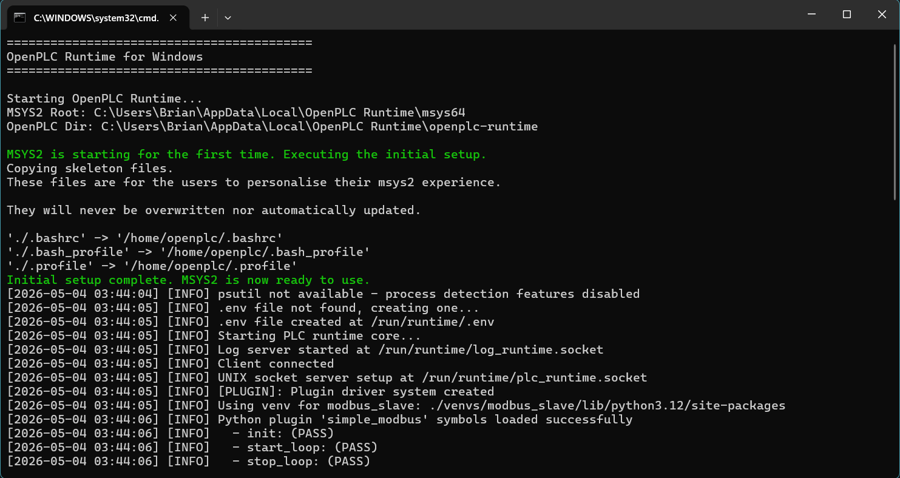

# Installation Process
## Installing OpenPLC Editor
1. Downloaded the Windows installer from [Autonomy](https://autonomylogic.com/download).
2. Used installer to install OpenPLC Editor.
### Screenshots

## Installing OpenPLC Runtime
1. Downloaded Windows installer from [Autonomy](https://autonomylogic.com/runtime).
2. Used installer to install OpenPLC Runtime.
### Screenshots
