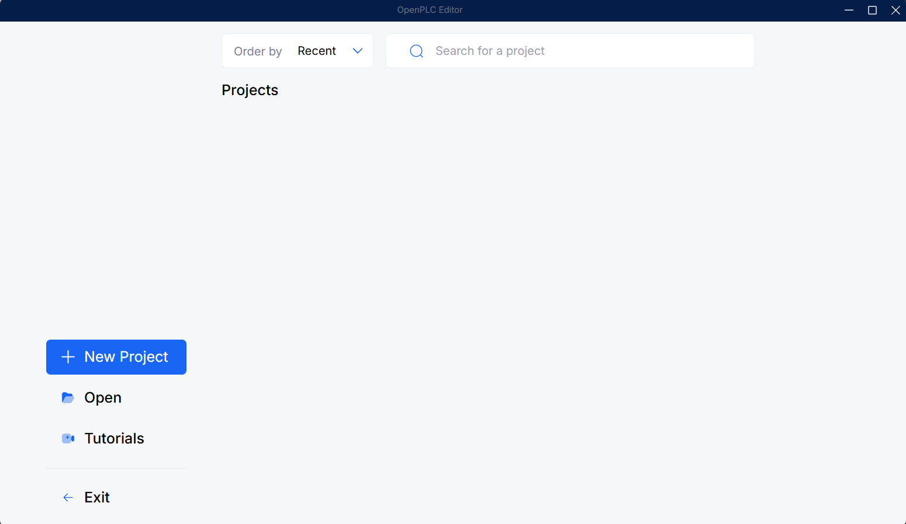
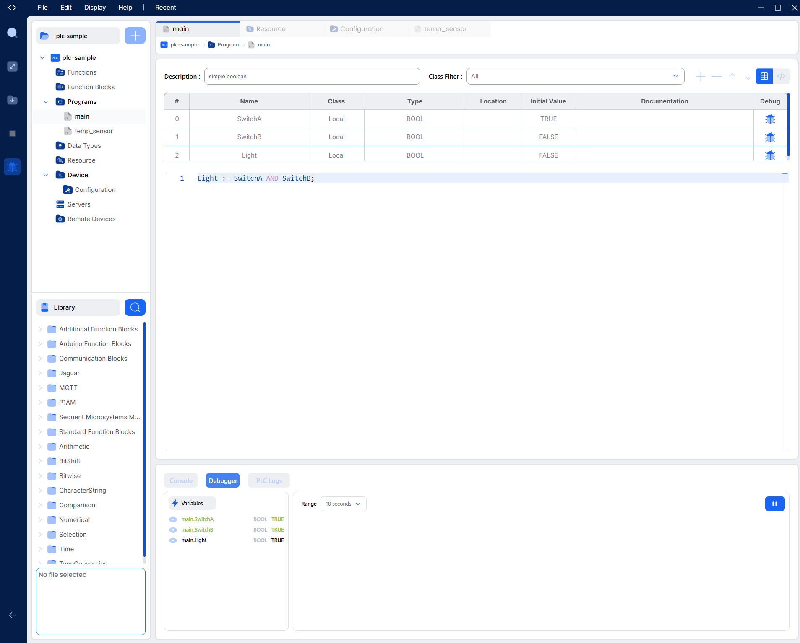
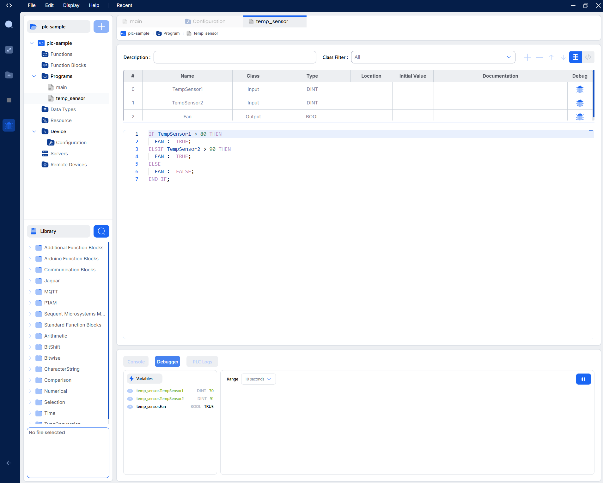

# PLC-Based Sample PLC/ICS Project Notes

## Installation Notes
### Installing OpenPLC Editor
1. Downloaded the Windows installer from [Autonomy](https://autonomylogic.com/download).
2. Used installer to install OpenPLC Editor.


### Installing OpenPLC Runtime
1. Pulled the Docker image and started the container on my WSL 2 Linux subsystem.


## Simple Boolean Program Notes
### Setting up OpenPLC Runtime with OpenPLC Editor
I spent some time chasing my own tail because I set the IP Address to "https://127.0.0.1:8443" for my OpenPLC Runtime v4 instance in the Configuration of my OpenPLC Editor which resulted in "Connection Failed".  It wasn't until I found a YouTube video with a walkthrough on the environment setup that I realized I only had to put in the ip address without the protocol or port, i.e. "127.0.0.1".

I created a simple boolean program with two boolean variables representing switches in serial to turn on a boolean variable representing a light.



## Temperature Control Scenario Program
### Attempting to setup OpenPLC Runetime V3
The task guide stated that I needed to show a successful deployment of the web-based interface of OpenPLC runtime.  That UI was deprecated in v4 because it was switched to a headless API server.  I attempted to set up OpenPLC Runtime V3 to use the UI but I ran into difficulties getting the ports exposed through my WSL instance, so I continued to use V4 with the editor and used the debugger on the editor to expose the variables during runtime operation.
### Temperature Control Scenario Logic Justification
My temperature control scenario is supposed to emulate the fan logic of a laptop computer (in a very simplified manner).  The laptop only has one fan which is either off or on at 100%.  The first temperature sensor is located on the GPU which has a thermal throttle limit of 80 degrees Celsius.  The second temperature sensor is located on the CPU which has a thermal throttle limit of 90 degrees Celsius.  If the thermal throttle limit is exceeded for either sensor, the fan will kick on to reduce temps to prevent throttling.



## Modbus Communication
### Attempting to setup Modbus TCP Client
I wrote a python script to test my temperature control scenario but I was unable to get my script to connect to my modbus server even though it was shown as running in the OpenPLC editor.

**OpenPLC Editor Logs**
```
[08-05-26 01:38:43]: [MODBUS_SLAVE] Configuration loaded - Host: 127.0.0.1, Port: 502
[08-05-26 01:38:43]: [MODBUS_SLAVE] Buffer mapping format: segmented
[08-05-26 01:38:43]: [MODBUS_SLAVE] Segmented coils: %QX=8192 bits, %MX=0 bits, total=8192
[08-05-26 01:38:43]: [MODBUS_SLAVE] Segmented holding registers: %QW=0-1023, %MW=1024-2047, %MD=2048-4095, %ML=4096-8191, word_order=high_word_first
[08-05-26 01:38:43]: [MODBUS_SLAVE] Plugin initialized successfully - Host: 127.0.0.1, Port: 502
[08-05-26 01:38:43]: [MODBUS_SLAVE] Server listening on 127.0.0.1:502
[08-05-26 01:38:43]: Plugin modbus_slave started successfully
```

**modbus_client.py Error**
```
Connection to (127.0.0.1, 5020) failed: [WinError 10061] No connection could be made because the target machine actively refused it
```